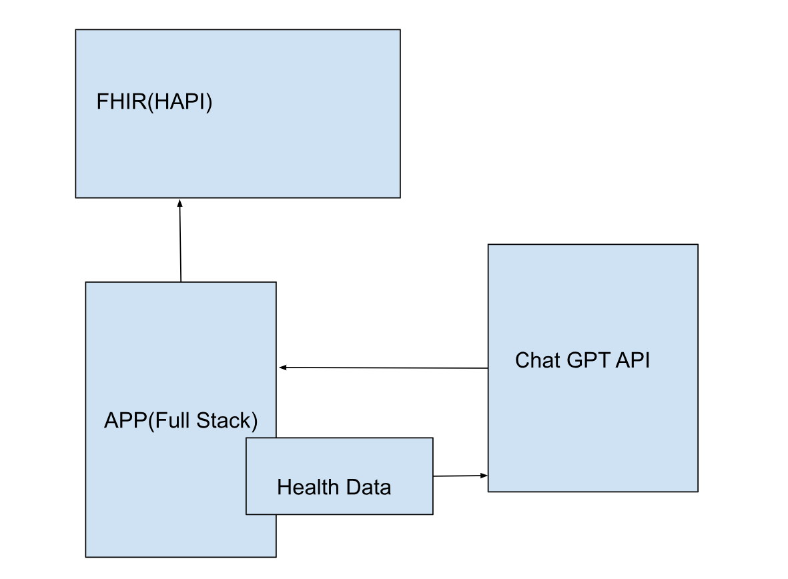

# Health_Informatics_Project_Team10
Team 10  

Fatema Hanif  

Yousra Hanif  

# Part 1 - Project Topic  

# Abstract:
Our project aims to change the way people take care of their skin by introducing a user-friendly skincare platform. In the world of personal hygiene and health, skincare is crucial, but many struggle due to too many products and not enough trustworthy guidance. Our platform addresses this issue by providing easy-to-understand and up-to-date information on skincare products and routines.  
The main goal of our platform is to empower users to manage their skincare effectively. We offer a carefully curated database of skincare products, including detailed info on ingredients, effectiveness, and user reviews. Additionally, we provide expert-written articles and guides on skincare routines for various concerns, helping users make informed choices based on their specific needs.  
We value inclusivity and cater to diverse skin types and concerns. Our platform encourages a community where users can share their experiences, insights, and recommendations. By creating a supportive space, we aim to make skincare less confusing and more enjoyable for everyone. 
The success of our platform depends on giving users the knowledge to make informed skin care decisions. Ultimately, we strive to enhance personal hygiene and health by fostering a community-driven approach to skincare, empowering individuals on their journey to healthier, more radiant skin.

# Background:
Our project focuses on developing a comprehensive skincare platform to address common skincare concerns. Skincare is a vital aspect of personal hygiene and health, yet many individuals struggle to find reliable information about skincare products and routines. Our platform aims to bridge this gap by providing users with accessible resources to make informed decisions about their skincare.
# Justification:
The skincare industry is vast and often overwhelming, with numerous products claiming various benefits. However, many consumers lack the knowledge to understand ingredients and their effects on the skin. Our platform seeks to empower users by offering educational content and personalized recommendations tailored to their specific skincare needs. By promoting skincare literacy and informed decision-making, we aim to enhance users' overall well-being and confidence.
# Solution:
Our solution involves creating an intuitive online platform where users can access information about skincare ingredients, routines, and dermatologist-recommended products. The platform will feature functionalities such as product ingredient analysis, skin type quizzes, personalized recommendations, and skincare routine management tools. Additionally, users will have access to educational resources and a directory of trusted dermatologists. Overall, our platform aims to simplify skincare routines and empower users to achieve healthier, happier skin.

# Part 2 - Technical Design
# Tools/Technology:
* JavaScript (JS)
* ReactJS for frontend development
* Node.js with Express.js for backend development
* MongoDB for database management
* Firebase for user authentication and data storage
* Vercel for website deployment
* HAPI FHIR for healthcare data integration
* Datasets and Data Sources:
* Research on skincare ingredients and their effects
* Dermatologist-recommended product databases
* User-generated data for personalized recommendations
* Healthcare data sourced through HAPI FHIR services

# Architecture Diagram

# Screen Mock-up(s): 
skincare product analysis, treatment suggestions. 

# Part 3 - Implementation Plan
# Project Tasks:
&emsp; Environment Setup:
* Set up a development environment with required tools and frameworks.  
&emsp; Frontend Development:
* Design user interface wireframes and mock-ups.
* Develop frontend components using ReactJS.  
&emsp; Backend Development:
* Set up a server using Node.js and Express.js.
* Implement API endpoints for user authentication and data management.  
&emsp; Database Integration:
* Set up a MongoDB database for storing user data and skincare information.
* Implement data models and schemas.  
&emsp; User Authentication:
Integrate Firebase for user authentication and authorization.  
&emsp; Skincare Product Analysis:
* Develop an algorithm for ingredient analysis.
* Integrate ingredient analysis tool into the platform.  
&emsp; Skin Type Quiz:
* Design and implement interactive skin type quizzes.
* Develop backend logic to process quiz results.  
&emsp; Personalized Recommendations:
* Research and implement recommendation algorithms.
* Develop frontend interface for displaying personalized product recommendations.  
&emsp; Skincare Routine Management:
* Design user interface for managing skincare routines.
* Implement backend logic for adding, editing, and deleting skincare products.  
&emsp; Educational Resources:
* Curate educational content about skincare ingredients and routines.
* Develop frontend interface for accessing educational resources.  
&emsp; Testing and Debugging:
* Conduct unit tests and integration tests.
* Debug issues and optimize performance.  
&emsp; Deployment:
* Deploy website on Vercel platform.
* Ensure scalability and reliability of the deployed application.  
&emsp; User Feedback and Iteration:
* Gather feedback from users through surveys and usability testing.
* Iterate on the platform based on user feedback to improve user experience.  
# Project Timeline:
| Weeks | Task                                                                                           |
|-------|------------------------------------------------------------------------------------------------|
| 7     | Environment Setup: Set up a development environment with required tools and frameworks.      |
| 8     | Frontend Development: Design user interface wireframes and mock-ups. Begin developing frontend components using ReactJS. |
| 9     | Frontend Development: Continue developing frontend components. Backend Development: Set up a server using Node.js and Express.js. |
| 10    | Backend Development: Implement API endpoints for user authentication and data management. Database Integration: Set up MongoDB database for storing user data and skincare information. Implement data models and schemas. |
| 11    | User Authentication: Integrate Firebase for user authentication and authorization. Skincare Product Analysis: Develop an algorithm for ingredient analysis. Integrate ingredient analysis tool into the platform. |
| 12    | Skin Type Quiz: Design and implement interactive skin type quiz. Develop backend logic to process quiz results. |
| 13    | Personalized Recommendations: Research and implement recommendation algorithms. Develop frontend interface for displaying personalized product recommendations. |
| 14    | Skincare Routine Management: Design user interface for managing skincare routines. Implement backend logic for adding, editing, and deleting skincare products. |
| 15    | Educational Resources: Compile educational content about skincare ingredients and routines. Develop frontend interface for accessing educational resources. Testing and Debugging: Conduct unit tests and integration tests. Debug issues and optimize performance. Deployment: Deploy website on Vercel platform. Ensure scalability and reliability of the deployed application. User Feedback and Iteration: Gather feedback from users through surveys and usability testing. Iterate on the platform based on user feedback to improve user experience. |

# Needs/Risks:
* Need access to reliable skincare ingredient databases for analysis.
* Risk of technical challenges in implementing recommendation algorithms.
* Dependency on user feedback for iterative improvements may affect project timeline.

